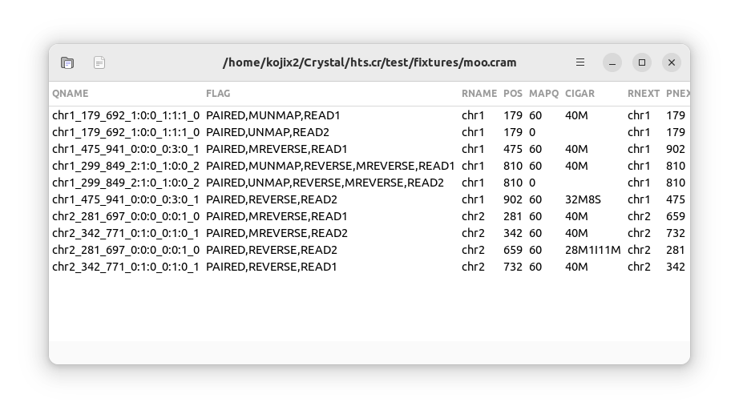

# HTSGrid

A simple SAM/BAM viewer



:construction: under development

## Installation

* [Crystal](https://crystal-lang.org/)
* [gtk4.cr](https://github.com/hugopl/gtk4.cr)
* [HTS.cr](https://github.com/bio-cr/hts.cr)

```sh
make
sudo make install
```

## Usage

```
htsgrid
```

## Development

This tool is designed for learning purposes.

```sh
shards install
crystal build src/htsgrid.cr
```

## Contributing

1. Fork it (<https://github.com/your-github-user/htsgrid/fork>)
2. Create your feature branch (`git checkout -b my-new-feature`)
3. Commit your changes (`git commit -am 'Add some feature'`)
4. Push to the branch (`git push origin my-new-feature`)
5. Create a new Pull Request
