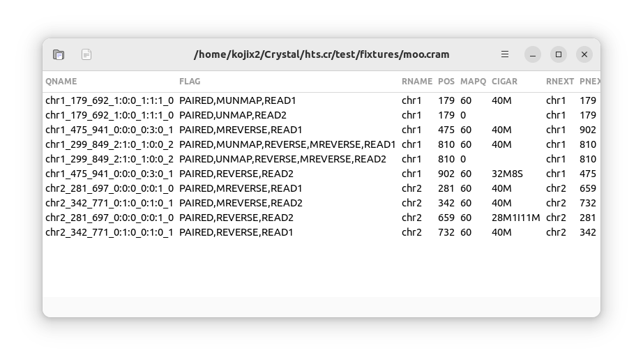

# HTSGrid

A small, read-only desktop viewer for SAM/BAM/CRAM and VCF/BCF files.



HTSGrid detects the file type from its contents and displays the standard
alignment or variant columns. VCF/BCF sample columns are shown dynamically.

## Installation

- [Crystal](https://crystal-lang.org/)
- GTK 4 and GObject Introspection
- [HTSlib](https://github.com/samtools/htslib)

```sh
make
sudo make install
```

## Usage

```text
htsgrid
```

## Development

```sh
shards install
bin/gi-crystal
crystal spec
make
```

## Contributing

1. Fork it (<https://github.com/bio-cr/htsgrid.cr/fork>)
2. Create your feature branch (`git checkout -b my-new-feature`)
3. Commit your changes (`git commit -am 'Add some feature'`)
4. Push to the branch (`git push origin my-new-feature`)
5. Create a new Pull Request
